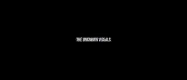

### <b>Unknown Visuals</b> a.k.a <b>Reynaldhi</b>
> As my username said you probably don't know me lol.

Subtitle

<empty></empty>

>"Bang lari bang ada meteor!"

>"Bang?"

>"<i>Mada kono sekai wa</i>"

>"Anjir <b>WIBU</b>"

Others

<empty></empty>

Social Media!
Cause GitHub only ask for my Twitter, which I rarely use. So, here you go:

| Social Media  | Link  |
|:--------------|:------|
| YouTube       |<a href="https://www.youtube.com/channel/UCzNk7qt2VK8LsrTn_eXuf_A" target="_blank"> Unknown Visuals </a> |
| Facebook      |<a href="https://web.facebook.com/people/Reynaldhi/100010470690467/" target="_blank"> Reynaldhi </a>     |
| Instagram     |<a href="https://www.instagram.com/reynaldhi.png/" target="_blank"> @reynaldhi.png </a>                  |
| Twitter       |<a href="https://twitter.com/reynaldhi_txt" target="_blank"> @reynaldhi_txt </a>                         |

<!--
**UnknownVisuals/UnknownVisuals** is a ✨ _special_ ✨ repository because its `README.md` (this file) appears on your GitHub profile.

Here are some ideas to get you started:

- 🔭 I’m currently working on ...
- 🌱 I’m currently learning ...
- 👯 I’m looking to collaborate on ...
- 🤔 I’m looking for help with ...
- 💬 Ask me about ...
- 📫 How to reach me: ...
- 😄 Pronouns: ...
- ⚡ Fun fact: ...
-->
